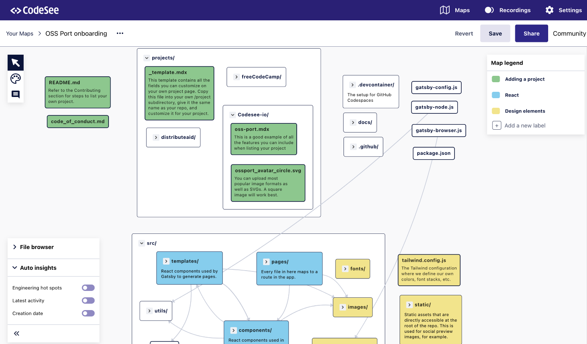

# OSS Port

[](https://app.netlify.com/sites/gracious-sammet-0b4268/deploys)

## Running this project locally

1. Clone this repo
1. Inside the project directory, install the dependencies using [Yarn](https://classic.yarnpkg.com/en/):

   ```shell
   yarn
   ```

1. Run the project locally:

   ```shell
   yarn start
   ```

1. You can now view the project in your browser at http://localhost:8000

## Contributing

The CodeSee Map below is a good way to get familiar with the codebase:

[](https://app.codesee.io/maps/public/66e14ff0-0c28-11ec-83a7-234deb28a370)

### How to list your own project

1. Follow the above setup steps
1. Create a new folder inside `/projects` and name it the same as your GitHub handle or organization
1. Add a new `.mdx` file using the name of your public repo
1. Copy/paste the contents of `projects/_template.mdx` into that file
1. Fill out the information — most of it is optional, but extremely helpful for potential contributors. If you opt not to include the optional content, delete it from your template.
1. Add a 200x200 image for your organization to your folder, for example, `./projects/distributeaid/da.png`
1. Preview your changes locally
1. When you're ready, open a PR!

### Adding a CodeSee Map to your project listing

Make it easier for contributors to onboard to your project! With a CodeSee Map, they can visualize the entire codebase, with features allowing them to explore system dependencies, add additional context to pull requests, and more.

To add a Map to your project:

1. Sign up for [CodeSee Maps](https://codesee.io) (there's no commitment or cost!)
1. Create a Map for your repo following [our instructions](https://docs.codesee.io/en/latest/)
1. Add an entry in your project's template for the Map (see example from Distribute Aid's Shipment Tracker project):

```
featuredMap:
  url: https://app.codesee.io/maps/public/b7367890-0129-11ec-a91a-57f039601939
  description: Get a quick overview of the major areas of our repo
```

### How to remove your project from OSS Port

Open a PR to remove your project folder from this repository.

### Notes

- Please pin the exact version of dependencies
